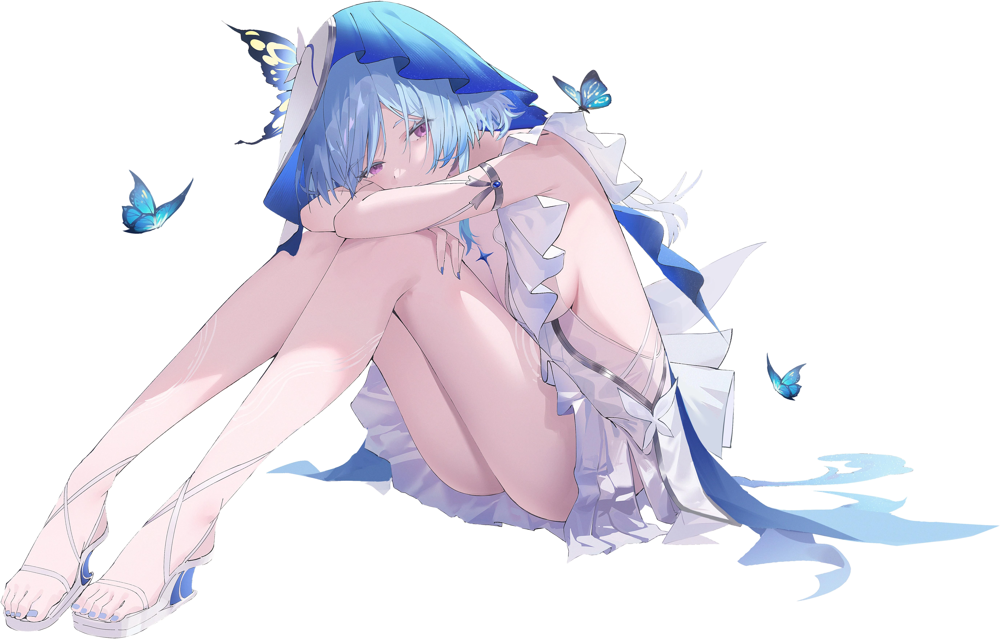

  

   

<h1 align="center">
  The Shorekeeper Collective
</h1>

<i>"The Shorekeeper"... This name suits me well enough. It aligns with my purpose and drive: they only exist because of you.</i>

<h2 align="center">About Us</h2>
We build tools, applications and host open-source software on our infrastructure, to serve people from the Black Shores (or the Earth, if you want to say it)

<h2 align="center">Projects</h2>   

- Memokeeper, a self-hostable blogging platform. Simple, elegant and powerful.   
- Inspectra, a managed photo hosting platform   
- *and more to come...*

<h2 align="center">Community</h2>   
For now, this is an one-man operation. If you can join or help us in any capacity, we appreciate that!

...

---

🩵

